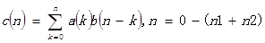

/*题目描述
    多项式
    多项式的系数[b(2)b(1)b(0)]=[1 2 5]
    二者相乘所得的多项式的系数[c(3)c(2)c(1)c(0)]=[1 3 7 5]
    利用上面的计算方法，我们很容易得到：
    c(0)=a(0)b(0)
    c(1)=a(0)b(1)+a(1)b(0)
    c(2)=a(0)b(2)+a(1)b(1)+a(2)b(0)
    c(3)=a(0)b(3)+a(1)b(2)+a(2)b(1)+a(3)b(0)
    其中：a(3)=a(2)=b(3)=0

    在上面的基础上推广一下：
    假定两个多项式的系数分别为a(n),n=0-n1和b(n),n=0-n2,这
    两个多项式相乘所得的多项式系数为c(n),则：
    c(0)=a(0)b(0)
    c(1)=a(0)b(1)+a(1)b(0)
    c(2)=a(0)b(2)+a(1)b(1)+a(2)b(0)
    c(3)=a(0)b(3)+a(1)b(2)+a(2)b(1)+a(3)b(0)
    c(4)=a(0)b(4)+a(1)b(3)+a(2)b(2)+a(3)b(1)+a(4)b(0)
    以此类推可以得到卷积算法：
     

    上面这个式子就是a(n)和b(n)的卷积表达式
    通常我们把a(n)和b(n）的卷积记为：a(n)*b(n),其中的*表示卷积运算符

    输入描述：
    两个最高阶数为4的复数多项式系数序列。高阶系数先输入，每个系数为复数，复数先输入实数部分，
    再输入虚数部分，实部或者虚部为0，则输入0；
    每个实部和虚部的系数最大值不超过1000
    输出描述
    求卷积多项式系数输出；先输出高阶系数，多项式算法：
      

    示例
    输入
    1
    1
    1
    1
    1
    1
    1
    1
    1
    ...
    输出
    0
    2
    0
    4
    0
    6
    0
    8
    0
    10
    0
    8
    0
    6
    ...
 */

public class Test2 {
}
